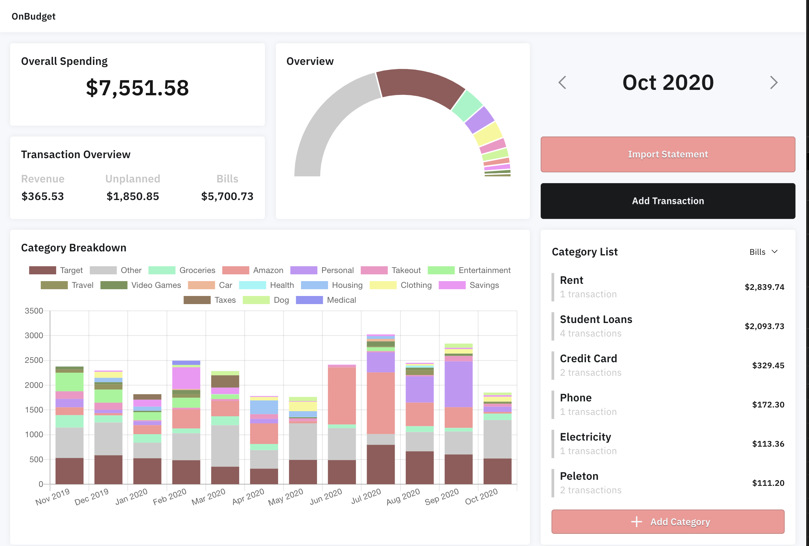
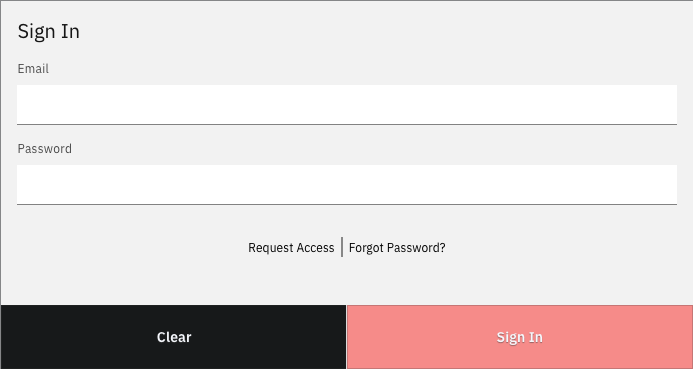
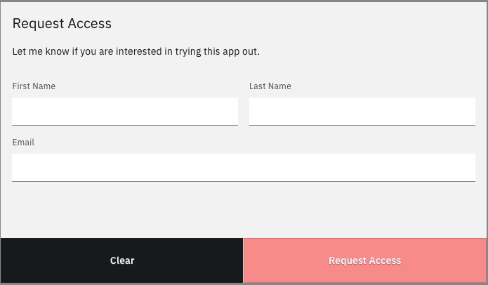
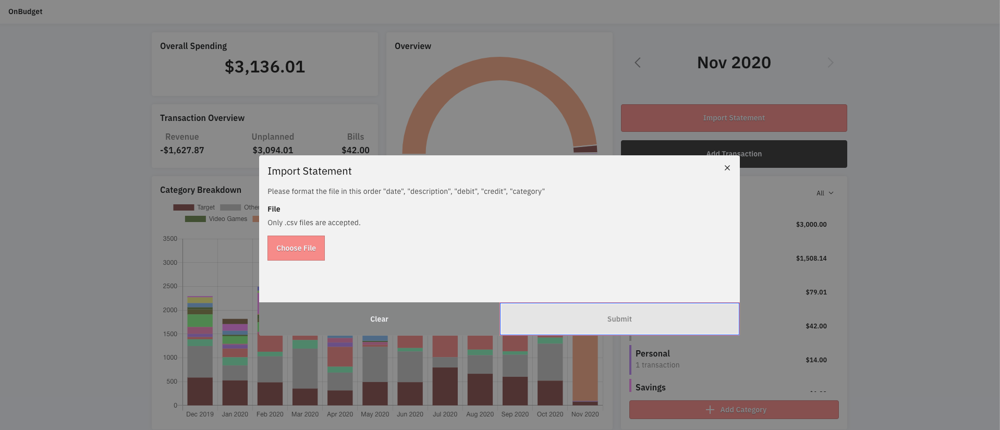
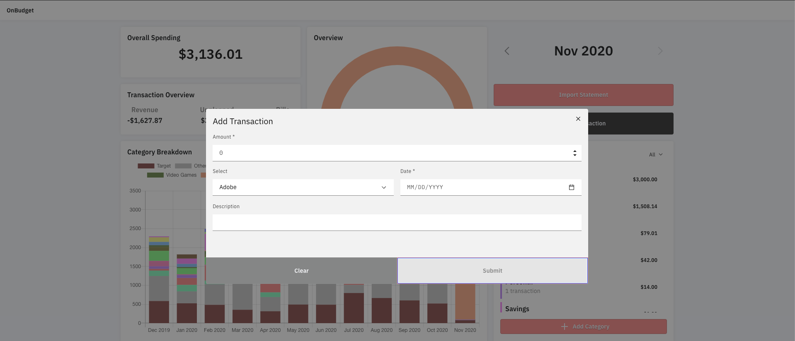
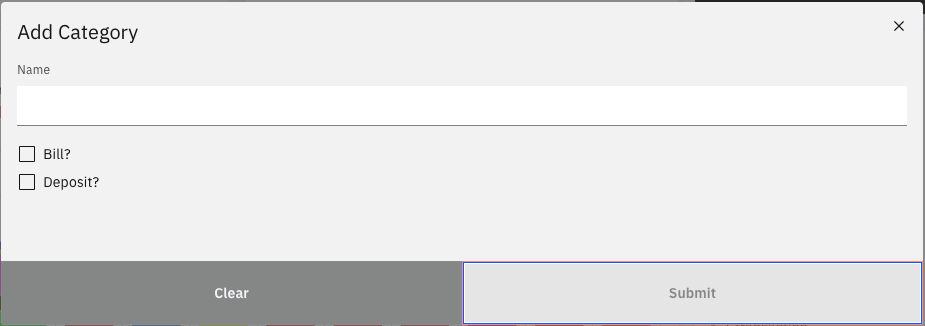

  

## About

This project was heavily influenced by the amazing work done by <a href="https://github.com/inoda">Lana Noda</a> and is also a budgeting tool hence why the name is similar. The main difference is that, it's being hosted on a digitalocean server for the static content and <a href="https://firebase.google.com/">Google Firebase</a> for all of the database and authentication logic. You can absolutely self host this (I will describe that later, however) it's currently accessible at <a href="https://onbudget.app">onbudget.app</a>.

## Why?

I was using Lana's app <a href="https://github.com/inoda/ontrack">ontrack</a> for a couple of months and fell in love with it, but I'm not a ruby developer and I found the process of development within that project a bit challenging and so I decided to build my own version with all the features I wanted.

## Table of Contents
- [Features](#features)
    * [Dashboard](#dashboard)
    * [User Account](#user-account)
    * [Request Access](#request-access)
    * [Forgot Password](#forgot-password)
    * [Loading States](#loading-states)
    * [Importing CSVs](#importing-csvs)
    * [Add Transaction](#add-transaction)
    * [Add Category](#add-category)
    * [Edit Category](#edit-category)
- [Running Locally](#running-locally)
    * [Prerequisites](#prerequisites)
    * [Local Development](#local-development)
- [Available Scripts](#available-scripts)
- [Dependencies](#dependencies)

## Features

### Dashboard
Currently, the dashboard is an overview of the current month, it gives you how much in bills and expenses you have spent, how much total revenue is coming into your account, breaksdown the monthly spending by category and gives a look back of the last year of spending in a stacked graph.

### User Account
Signing in allows multiple users to use this on the same machine

### Request Access
Requesting Access is a temporary feature for me to see how much I (dis)like firebase usage

### Forgot Password
Allows the user to receive an email from firebase if you forgot your password

### Loading States
Sometimes the app is slow, this is just some consistent loading states for the application

### Importing CSVs
Since this app does not make any requests to your actual bank, this allows you to import a statement you can download from you bank account

### Add Transaction
A simple modal to quickly add an individual expense/transaction

### Add & Edit Category
Another modal to create categories for your spending

## Running Locally

#### Prerequisites
* Node and npm installed on your machine
* A Firebase project setup in order to get the configuration
* A Firebase billable account in order to deploy functions
* Initialization of firebase cloud firestore and functions

Once you have all of that in place, place your firebase configuration into the appropriate `.env` file so that it can be used by the application

#### Local Development

Given the commands within the package.json you can do one of two things
**1.** `npm start` Run locally and point to the firebase production instance
**2.** `npm run start:emulate` Run locally and point to the firebase local emulator you have set up

## Available Scripts

### `npm start`
Run locally and point to the firebase production instance

### `npm run start:emulate`
Run locally and point to the firebase local emulator you have set up

### `npm run build`
Builds the app for production to the `build` folder. The build is minified and the filenames include the hashes.

### `npm run eject`
Ejects the CRA application in order for you to have access to the webpack instance for further customization

### `npm run firebase`
Spins up a fresh firebase emulator for local development without any saved data
**TODO:** Add concurrently in order to put `start:emulate` and `firebase` together

### `npm run firebase:deploy`
Takes the functions folder and uploads them to firebase functions

### `npm run firebase:populate`
Spins up a firebase emulator with any previously stored data

### `npm test`
Launches the test runner in the interactive watch mode. 
See the section about [running tests](https://facebook.github.io/create-react-app/docs/running-tests) for more information.

### `npm run test:watch`
Runs all unit tests in watch mode for file changes

### `npm run test:coverage`
Runs all unit tests and generates a coverage report

### `npm run create-component`
ex: `npm run create-component -- -c Test`
A script that creates a component with appropriate scaffolding for scss files, tests and the component

## Dependencies
**TODO**

 
 
 
 
 
#### too lazy to remove this for now, just some notes for myself

Using Sentry for error tracking
If solving a sentry bug, include the issue # within the commit